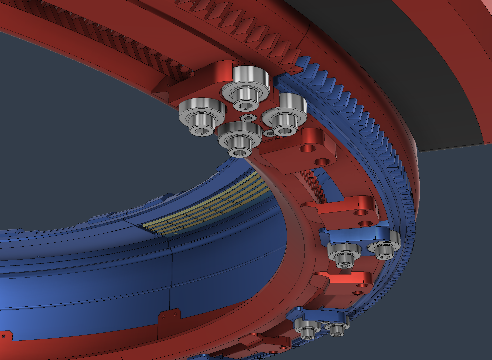

# Motion Shell

## The Narrative

After deciding the basis of sensor control and positioning, it became clear that this had to be under the modular format. Each measuring unit had to move independently inside the dedicated rail or track, allowing them to install themselves anywhere inside the rail.



So the earlier version of this shell was made to meet the requirements. The overall intention of the design didn't differ too much compared to the modern one. The main shell rotates infinitely on the dedicated circular rail, providing speed and robustness, and each sensor unit moves inside the shell to precisely position and orient sensors. The disparity was that it had separate sectors of inner rails, and the motors to move the shell were located inside the shell, between two sectors.


I was aware that a sensor carriage unit's positioning capability would be inside -60 to 60 degrees, so a fully connected rail wouldn't help that much in measurement but only add complexity of homing each module, as there would be no limit without blockades. Also, it was clear that this kind of sensor positioning only enables measurement on the XY plane. It can't see anything that can be observed from different angles. So I thought that fully rotating the external motion axis would make it possible to measure proximity from tilted angles. So I didn't see much of a problem at that point.

However, as some testing happened, the design revealed plenty of limitations. First of all, it was highly inconvenient to place and remove carriage modules. I had to disassemble the whole shell to replace and insert modules. This was a barrier both for testing and practical uses. Another problem was that the tilting method was never going to work; there are multiple linear rods and screws utilized by the motion shell itself and possibly the printbed, which is the platform of the main measurement. Rotating the whole shell was unlikely since avoiding collisions with those parts is physically impossible.

So I had to think of an improved design that simultaneously solves the tilting capability and the difficulty of replacements.


What I eventually came up with was about folding the half of the shell, and removing the division of sectors. The motors that power the shell rotation are externalized for this reason. Now the modules can move infinitely inside the shell, and the shell itself can fold from 0 to 90 degrees. When it's 0, it operates as intended: modules move freely, and orient sensors at required locations. When I need measurement from the top, or angles other than just on the XY plane, some sensors can move to the folding side of the shell, and then it can tilt to the needed angle. If I have to replace, remove, or insert modules, the shell can be tilted to 90 degrees and they can be easily removed from the rigid side of the shell. The module homing is still possible: simply put modules on the folding side, tilt to 90 degrees, and move the modules to the end of each side. The rigid side's ceiling makes a proper blockade, a reference for homing. The concerns around collisions on full tilt were fully resolved too. Now it only has to beware of components above (e.g., printer heads) the shell.

With this improvement, the critical problems were all resolved and made an excellent breakthrough that conventional CT device structures didn't offer. The attempt to create a framework for modular sensor units with ultrasonic measurement turned out to be successful.

---

## Technical Specifications

All of the designed parts other than off-the-shelf components like steppers and fasteners are 3D printed with an FDM printer, PLA + carbon fiber mixed material.


### Tilting System


- 1:3 reduction spur gears, 1:1 bevel gears, 1:4 reduction planetary gears, total 1:12 reduction
- 20mm NEMA 17
- Custom controller board


### Rotation System


- Same controller boards are used
- 360:31 reduction total
- Z-axis shaft bushings and screw nuts
- A physical homing switch is installed


- Rotational indicators of the tilting system click the switch to indicate positions
- The frame structure ensures click loss doesn't happen


---

## Circuit Specifications


### MCU

**STM32F103C8T6** (LQFP48)
- Clock: 16MHz HSE crystal, no PLL (SYSCLK = HSE directly)
- MCO output on PA8 provides reference clock
- Peripherals: CAN1, I2C1, TIM1, TIM4, USART1/2/3
- DMA channels for I2C and UART transfers

### Stepper Driver

**TMC2209-LA-T** configured via single-wire UART (USART3 at 115200 baud):

| Register | Address | Value | Purpose |
|----------|---------|-------|---------|
| GCONF | 0x00 | pdn_disable=1, mstep_reg_select=1, multistep_filt=1 | Enable UART, register microstep |
| CHOPCONF | 0x6C | toff=3, hstart=4, hend=0, tbl=1, mres=0b0100, interpolation=1 | 16× microstepping with 256× interpolation |
| IHOLD_IRUN | 0x10 | ihold=8, irun=31 | Hold 8/32, Run 31/32 of max current |
| TCOOLTHRS | 0x14 | 300 | CoolStep threshold |
| SGTHRS | 0x40 | 50-75 | StallGuard threshold (adjusted during homing) |
| TPWMTHRS | 0x13 | 40 | StealthChop threshold |

Current sense resistors: 100mΩ (R15, R16)

### Position Feedback

**MT6701CT-STD** 14-bit magnetic rotary encoder
- I2C interface at 100kHz (hi2c1)
- DMA-enabled transfers for non-blocking reads
- Mounted directly under motor shaft

### Power Architecture

- **Input**: 7-30V DC via Vin rail
- **Main regulation**: TPS54331DR buck converter → 6V intermediate
- **Logic supply**: AMS1117-3.3 LDO → 3.3V
- **Motor supply**: Direct from 6V/12V rail to TMC2209 VM pin

### Motor Configuration

**Stepper outputs**:
- STEP: PB0, DIR: PB1, ENN: PA6
- 4-wire bipolar connection through TMC2209

**DC motor drivers** (module controller variant):
- Dual DRV8837DSGR H-bridges
- PWM1: PA2/PA3, PWM2: PA4/PA5
- Magnetic encoders via dedicated GPIO

### CAN Bus

**SN65HVD230DR** transceiver:
- TX: PA11 (CAN_TX), RX: PA12 (CAN_RX)
- Slope control: RS pin tied to CAN_SPEED (PA7)
- 120Ω termination resistor on bus
- FIFO0 with hardware filtering

CAN timing (1Mbps at 16MHz):
```c
hcan.Init.Prescaler = 1;
hcan.Init.SyncJumpWidth = CAN_SJW_1TQ;
hcan.Init.TimeSeg1 = CAN_BS1_13TQ;
hcan.Init.TimeSeg2 = CAN_BS2_2TQ;
```

### GPIO Pin Mapping

| Pin | Function | Mode |
|-----|----------|------|
| PA6 | ENN (motor enable) | Output, active low |
| PA7 | CAN_SPEED | Output |
| PA8 | MCO (clock out) | Alternate function |
| PA12 | Homing switch (rotation) | Input, no pull |
| PB0 | STEP | Output |
| PB1 | DIR | Output |
| PB15 | STAT LED | Output |
| PA5 | DIAG (stall detect) | EXTI rising edge, pull-down |

---

## Firmware Architecture

Two firmware variants share the same controller board: **CP_Rotary** (rotation axis, shell) and **CP_Rotator** (tilting axis).

### Project Structure

```
CP_Rotary/  (or CP_Rotator/)
├── Core/
│   └── Src/
│       └── main.cpp          # HAL init, main loop, interrupt callbacks
└── peripheral/
    ├── Inc/
    │   ├── can.h             # CAN protocol definitions, handler types
    │   ├── motors.hpp        # Stepper control interface
    │   ├── rotary.h          # High-level motion API (rotation)
    │   └── stepper_setting.hpp  # TMC2209 register maps and UART protocol
    └── Src/
        ├── can.cpp           # CAN TX/RX, command handlers, data serialization
        ├── motors.cpp        # Timer-based step generation, acceleration
        ├── rotary.cpp        # Homing sequences, angle-to-step conversion
        └── stepper_setting.cpp  # TMC2209 configuration and communication
```

The `peripheral/` directory contains all custom application code. `Core/` holds STM32CubeMX-generated HAL initialization with user code sections for integrating the peripheral modules.

### CAN Bus Network

Dual-motor synchronized drive architecture:

| Axis | Master Device ID | Slave Device ID | Report to Master |
|------|------------------|-----------------|------------------|
| Rotation | 0x200 | 0x201 | 0x700 |
| Tilting | 0x100 | 0x101 | 0x700 |

Filter configuration uses exact-match mode (mask 0x7FF) to receive only addressed messages.

### CAN Protocol

8-byte frame format with handler-based dispatch:
```
Byte 0: [4-bit handler ID][4-bit command]
Bytes 1-7: Command-specific payload
```

Handlers are registered at initialization:
```c
handlers[0].id = 0x1; handlers[0].handler = motor;
handlers[1].id = 0x2; handlers[1].handler = rotator;
handlers[2].id = 0x3; handlers[2].handler = prompt;
```

**Handler 0x1 - Low-Level Motor Control:**

| Cmd | Name | Payload | Description |
|-----|------|---------|-------------|
| 0x10 | Move | int32[1-4] steps, uint8[5] dir | Move specified steps in direction |
| 0x11 | Stop | — | Immediate stop |
| 0x12 | Enable | uint8[1] state | Enable/disable driver |
| 0x13 | Reset | — | Disable-delay-enable sequence |
| 0x14 | SetSpeed | int16[1-2] period | Timer period in µs |
| 0x15 | SetCurrent | uint8[1] run, [2] stall, [3] hold | TMC current settings |
| 0x16 | SetAccel | uint8[1] rate, [2] threshold | Acceleration parameters |
| 0x1E | QueryRunning | — | Returns running state |
| 0x1F | QueryPosition | — | Returns int32 location_steps |

**Handler 0x2 - High-Level Motion (Rotation):**

| Cmd | Name | Payload | Description |
|-----|------|---------|-------------|
| 0x20 | Home | — | Initiate homing sequence |
| 0x21 | MoveAngle | float[1-4] degrees | Move to absolute angle |
| 0x22 | SetSpeed | int16[1-2] | Set default speed |

**Handler 0x2 - High-Level Motion (Tilting):**

| Cmd | Name | Payload | Description |
|-----|------|---------|-------------|
| 0x20 | HomeDir0 | — | Home in negative direction |
| 0x21 | HomeDir1 | — | Home in positive direction |
| 0x22 | FullHome | — | Complete two-phase homing |
| 0x23 | MoveAngle | float[1-4] degrees | Move to angle (0-90°) |
| 0x24 | SetSpeed | int16[1-2] | Set default speed |

### Data Serialization

```c
void send_int32(int32_t value, uint8_t *data) {
    data[0] = (value >> 24) & 0xFF;  // MSB first
    data[1] = (value >> 16) & 0xFF;
    data[2] = (value >> 8) & 0xFF;
    data[3] = value & 0xFF;
}

void packFloat(float value, uint8_t *buffer) {
    FloatBytes fb;
    fb.f = value;
    memcpy(buffer, fb.bytes, sizeof(float));
}
```

### TMC2209 UART Protocol

Single-wire UART communication using USART3 at 115200 baud. Write datagrams are 8 bytes:

```c
union WriteReplyDatagram {
    struct {
        uint64_t sync : 4;            // 0b0101
        uint64_t reserved : 4;
        uint64_t serial_address : 8;  // 0x00
        uint64_t register_address : 7;
        uint64_t rw : 1;              // 1 = write
        uint64_t data : 32;           // LSB first after reversal
        uint64_t crc : 8;
    };
    uint64_t bytes;
};
```

CRC calculation:
```c
uint8_t calculateCrc(Datagram & datagram, uint8_t datagram_size) {
    uint8_t crc = 0;
    for (uint8_t i = 0; i < (datagram_size - 1); ++i) {
        uint8_t byte = (datagram.bytes >> (i * 8)) & 0xFF;
        for (uint8_t j = 0; j < 8; ++j) {
            if ((crc >> 7) ^ (byte & 0x01))
                crc = (crc << 1) ^ 0x07;
            else
                crc = crc << 1;
            byte = byte >> 1;
        }
    }
    return crc;
}
```

### Timer-Based Step Generation

TIM4 configured as step pulse generator (prescaler 16-1, 1µs resolution):

```c
void Stepper_TIM_Interrupt() {
    static uint16_t time_before;

    if (stepper.current_steps < stepper.steps_to_go) {
        // Generate step pulse
        HAL_GPIO_WritePin(stepper.STEP_PORT, stepper.STEP_PIN, GPIO_PIN_SET);
        HAL_GPIO_WritePin(stepper.STEP_PORT, stepper.STEP_PIN, GPIO_PIN_RESET);

        stepper.current_steps++;
        stepper.dir ? stepper.location_steps++ : stepper.location_steps--;
        stepper.time += __HAL_TIM_GET_AUTORELOAD(stepper.htim_stepper) * accel_rate;
    } else {
        // Movement complete
        stepper.is_running = 0;
        if (on_program) {
            on_program = 0;
            uint8_t packet[8] = {0x20};  // Notify master
            CAN_Tx(packet, 8, MASTER_ID);
        }
        HAL_TIM_Base_Stop_IT(stepper.htim_stepper);
    }

    // Deceleration: check if remaining steps fit within stopping distance
    if (stepper.steps_to_go - stepper.current_steps
        <= (accel_th - __HAL_TIM_GET_AUTORELOAD(stepper.htim_stepper)) *
           (50000 / (__HAL_TIM_GET_AUTORELOAD(stepper.htim_stepper) * accel_rate))
        && __HAL_TIM_GET_AUTORELOAD(stepper.htim_stepper) < accel_th
        && stepper.time / 50000 != time_before) {

        time_before = stepper.time / 50000;
        __HAL_TIM_SET_AUTORELOAD(stepper.htim_stepper, 
            __HAL_TIM_GET_AUTORELOAD(stepper.htim_stepper) + 1);  // Slow down
    } else {
        // Acceleration
        if (__HAL_TIM_GET_AUTORELOAD(stepper.htim_stepper) > stepper.step_period
            && stepper.time / 50000 != time_before) {
            time_before = stepper.time / 50000;
            __HAL_TIM_SET_AUTORELOAD(stepper.htim_stepper,
                __HAL_TIM_GET_AUTORELOAD(stepper.htim_stepper) - 1);  // Speed up
        }
    }
}
```

Parameters:
- `accel_rate`: Timer increment per step (default 4)
- `accel_th`: Acceleration threshold period (default 250µs)
- `speed_default`: Default step period (300µs)

### Homing Sequences

**Rotation (CP_Rotary) - Physical Switch:**

PA12 input detects homing switch state. Three-phase homing:

```c
void home() {
    if (phase == HOMING_DONE) {
        phase = STEP1;
        Stepper_Move(-INFI);  // Move negative until switch
    } else if (phase == STEP1) {
        phase = STEP2;
        Stepper_Stop();
        stepper.location_steps = 0;
        Stepper_Move(INFI);   // Move positive to find range
    } else {
        phase = HOMING_DONE;
        Stepper_Stop();
        // Calculate center position
        if (stepper.location_steps > (int32_t)roundf((360.0f / 31.0f) * USTEP_RATE * 100))
            stepper.location_steps /= 2;
        else
            stepper.location_steps = (stepper.location_steps / 2) 
                + (int32_t)roundf((360.0f / 31.0f) * USTEP_RATE * 100);
    }
}
```

Main loop polls PA12:
```c
if (HAL_GPIO_ReadPin(GPIOA, GPIO_PIN_12) && !cnt) {
    if (phase == STEP1 || phase == STEP2) home();
    cnt = 1;
}
```

**Tilting (CP_Rotator) - StallGuard Sensorless:**

DIAG pin triggers EXTI interrupt on stall detection:

```c
void home(uint8_t dir) {
    homing = 1;
    if (!dir) {
        Stepper_SetSpeed(250);           // Slower for reliable stall detection
        write(0x40, 75);                 // Increase SGTHRS sensitivity
        currentSetup(driver_current_, hold_current, stall_current);  // Reduce current
        Stepper_Move(-INFI);
    } else {
        Stepper_Move(1000);              // Move away from limit
    }
}

void HAL_GPIO_EXTI_Callback(uint16_t GPIO_Pin) {
    if (homing && sg_result >= 130) {
        stall_flag = 1;  // Processed in main loop
        return;
    }
}

void rotator_reset(uint8_t dir) {
    if (!dir) {
        Stepper_Stop();
        Stepper_Reset();
    }
    write(0x40, 50);                     // Restore normal SGTHRS
    currentSetup(driver_current_, hold_current, current);
    Stepper_SetSpeed(speed_default);
    homing = 0;

    if (!stepper.dir) stepper.location_steps = -1000;

    if (step == STEP1) { step = STEP2; home(0); }
    else if (step == STEP2) { step = HOMING_DONE; }
}

void full_home() {
    if (step == HOMING_DONE) {
        uint8_t send[8] = {0x22};
        CAN_Tx(send, 8, SLAVE_ID);       // Sync slave
        step = STEP1;
        home(1);                          // Start with positive direction
    }
}
```

### Step-to-Angle Calculations

**Tilting (0° to 90° range):**
```c
float rotator_move(float pos) {
    if (pos < 0) pos = 0;
    if (pos > 90) pos = 90;
    uint16_t target = (uint16_t)(((USTEP_RATE * 600) * pos) / 90.0f + 0.5f);
    on_program = 1;
    
    if (pos == 0) {
        Stepper_Move(-1000 - stepper.location_steps);
        return 0.0f;
    } else {
        Stepper_Move(target - stepper.location_steps);
        return (float)(target * 90) / (float)(USTEP_RATE * 600);
    }
}
```
- USTEP_RATE = 16 (microstepping)
- 600 steps per 90° (after gear reduction)
- Full range: 16 × 600 = 9600 microsteps

**Rotation (360° continuous):**
```c
float rotary_move(float pos) {
    int32_t target = (int32_t)roundf((360.0f / 31.0f) *
            (USTEP_RATE * 200.0f) * pos / 360.0f);
    on_program = 1;
    Stepper_Move(target - stepper.location_steps);
    return (float)(target) / (float)(360.0f / 31.0f * USTEP_RATE * 200) * 360.0f;
}
```
- Gear ratio: 360:31 (pinion to ring gear)
- Steps per revolution: (360/31) × 16 × 200 ≈ 37161 microsteps

### Master-Slave Synchronization

Master forwards commands to slave for synchronized dual-motor operation:

```c
void Stepper2_Move(int32_t step) {
    uint8_t packet[8];
    packet[0] = 0x10;
    send_int32(abs(step), packet + 1);
    packet[5] = step < 0 ? 0 : 1;
    CAN_Tx(packet, 8, SLAVE_ID);
}

void Stepper2_SetSpeed(uint16_t speed) {
    uint8_t packet[8];
    packet[0] = 0x14;
    send_int16(speed, packet + 1);
    CAN_Tx(packet, 8, SLAVE_ID);
}
```

Completion notification sent to master controller (0x700):
```c
if (on_program) {
    on_program = 0;
    uint8_t packet[8] = {0x20};
    CAN_Tx(packet, 8, MASTER_ID);
}
```
