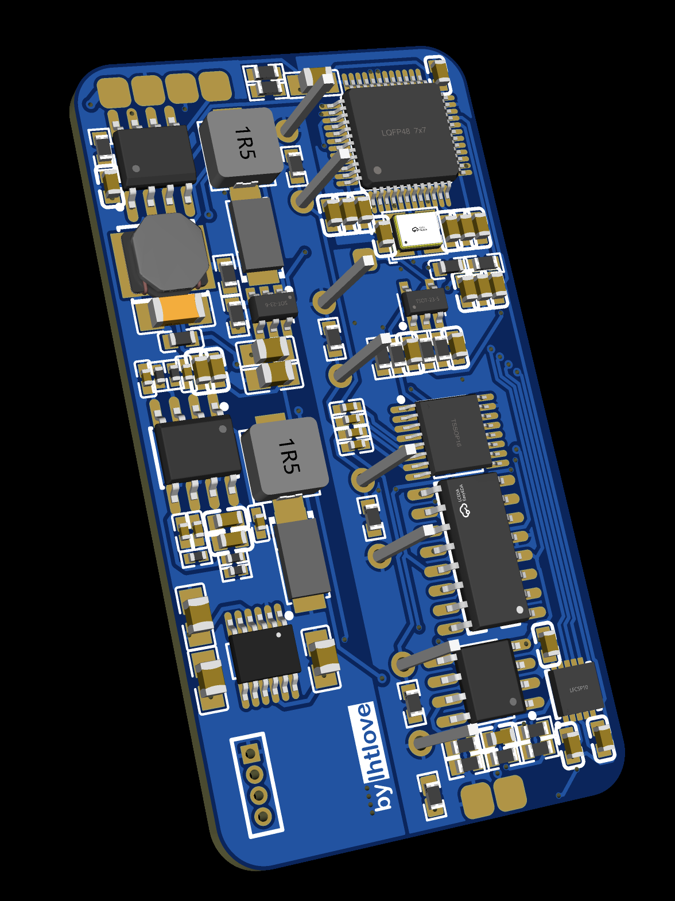
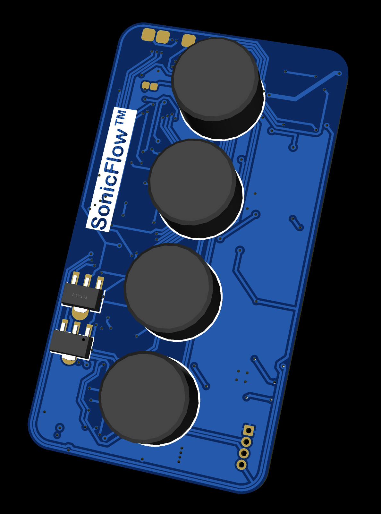

# Sensor Module

## The Narrative

The initial reason I became interested in ultrasonic-based scanning was its immunity to reflective surfaces and transparent objects—fundamental limitations of optical methods like LiDAR. However, ultrasonic sensors have their own well-known limitations for precision measurement: dependence on temperature affects propagation speed, making distance calculations unreliable when thermal conditions vary across the measurement path.

Initially, this project was nothing more than applying ultrasonic sensors as a temporary, inexpensive alternative to optical vision systems. Even after I recognized that the project's focus would be comprehensive feedback systems, ultrasonic methods seemed like cheap workarounds with inherent flaws that would need to be addressed.

### The Key Insight

At some point, I realized these "unfavorable" characteristics could actually be utilized rather than merely compensated. For most environments in room air, temperature is the sole factor determining propagation speed. This meant the overall temperature along a measurement path could be calculated if the distance were known. Initially, I wasn't sure how to make this practically useful.

Then I examined how computed tomography works. I had understood only the basics—that CT uses X-rays to capture layered images. But the principle is collecting how much of a beam reaches the other end across multiple angles, then reconstructing the actual internal structure from that data. Applying the same reconstruction approach with a different measurement type was the key insight.

Instead of measuring how much a beam attenuates (as in X-ray CT), ultrasonic CT would measure how fast the beam travels across a known distance. This directly yields the temperature of the traveled path. With measurements collected across multiple angles on a circular device, the data can be reconstructed into a map of sound propagation speed at specific locations within that layer—and consequently, a temperature map.

### Dual-Output Architecture

The critical realization was how this temperature data could then calibrate proximity measurements. By comparing the computed propagation speed map against the expected path of proximity measurements, the system can predict speed variations along any measurement trajectory. This eliminates errors caused by thermal gradients in the medium. While changes occurring between map updates remain unavoidable, this approach provides the best achievable accuracy unless the environment changes extremely rapidly.

This insight revealed how ultrasonic measurement could serve my application uniquely well. A single sensor type provides multiple outputs: first a 3D temperature distribution map (equivalently, a propagation speed map), then—with proper time-of-flight processing calibrated by that map—proximity measurements approaching theoretical resolution limits.

The traditional weakness of ultrasonic sensing becomes a feature. Temperature sensitivity, normally a source of error, becomes a source of environmental awareness.

### Development Reality

When I began searching for sensors capable of meeting my requirements, I found nothing commercially available that fully satisfied the conditions. To properly test these concepts, I needed individual transducer units with high directivity, high frequency, and detection range covering the scanning zone dimensions. Phased arrays were eliminated early—they focus on beam control and object detection rather than pure time-of-flight measurement.

I found transceiver units meeting these specifications, but designing the driving and reception circuitry was something I had to undertake independently. While demanding, this was also advantageous: I could design from scratch to fit specific requirements rather than adapting around existing module limitations.

This component required the longest development time relative to its conceptual complexity. Without prior background in analog circuit design, the process involved learning alongside building—resulting in some design choices that were overly cautious or redundant in hindsight. To maintain flexibility for testing various measurement approaches, the circuit was designed to control as many variables as possible, prioritizing adaptability over optimization.

### Current Status

Individual transmit and receive functions have been validated. The TX path successfully generates 300kHz bursts with sufficient amplitude to drive the transducers. The RX path captures and amplifies received signals with waveform integrity preserved for phase-based timing analysis.

Integration debugging remains in progress. Two issues currently prevent full scanning operation:

1. **TX/RX Channel Switching**: The analog switch configuration for single-transducer echo mode has implementation errors that prevent proper changeover between transmit and receive phases. The fix is identified but not yet implemented.

2. **Inter-Board Timing Synchronization**: Face-to-face two-sensor ToF measurement requires sub-microsecond timing coordination between separate boards. CAN bus communication, even at 1Mbps, introduces latency and jitter that degrades measurement accuracy. At 343 m/s sound speed, each microsecond of timing uncertainty corresponds to ~0.34mm distance error.

The core sensing concept—transmit, receive, preserve waveform, analyze for precise timing—functions correctly. What remains is resolving the integration issues that prevent the complete scanning workflow.

---

## Technical Specifications

| Parameter | Value |
|-----------|-------|
| Board Dimensions | 28mm × 52mm |
| Operating Frequency | 300kHz (DDS-generated) |
| Transducer Channels | 4 (independently switchable) |
| Drive Voltage | ±22V (bipolar) |
| ADC Resolution | 12-bit (STM32G4 internal) |
| Communication | CAN bus (1Mbps) |
| Input Voltage | 12V DC |

### Transducer Specifications

The system uses 300kHz ceramic ultrasonic transceivers selected for:

- **High Directivity**: ~10° beam width, enabling precise point-to-point measurement
- **Frequency**: 300kHz provides ~1.1mm wavelength in air, supporting sub-millimeter resolution with phase detection
- **Dual Function**: Same element serves as both transmitter and receiver (transceiver configuration)

---

## Circuit Specifications

| Sensor Board - Front | Sensor Board - Back |
|:--:|:--:|
|  |  |

### MCU

**STM32G431CBT6** (LQFP48)
- Clock: 16MHz HSE crystal, PLL-capable up to 170MHz
- Integrated op-amp and comparator peripherals
- 12-bit ADC with up to 4 MSPS sampling
- Peripherals: FDCAN, SPI, TIM1/2/3/4, USART
- DMA channels for ADC transfers

### Waveform Generation

**AD9837BCPZ-RL7** Direct Digital Synthesis (DDS)
- Frequency resolution: 0.1Hz with 16MHz MCLK
- Output: Sinusoidal waveform at 300kHz
- Interface: SPI (SCK, SDATA, FSYNC)
- Reference clock: MCO output from STM32

The DDS provides precise, phase-coherent waveform generation essential for phase-based ToF measurement. Unlike simple oscillator circuits, DDS allows exact frequency control and maintains phase relationship with the MCU's timer system.

### Transmit Signal Chain

```
AD9837 (DDS) → Low-pass Filter → TLE2142 (Amplification) → BJT Push-Pull Buffer → Transducer
                                                              ↓
                                                         DG412 (TX Switch)
```

**Signal Amplification Stage**
- **TLE2142IDR** dual precision op-amp
  - Stage 1: Initial gain with DC offset adjustment
  - Stage 2: Additional gain to reach transducer drive levels
  - Supply: ±22V (bipolar)

**BJT Push-Pull Output Buffer**
- **2SAR293P5T100** (PNP) and **2SCR293P5T100** (NPN)
- Provides current capacity for transducer drive
- Direct coupling to transducer elements

**Transmit Channel Selection**
- **DG412DY-T1-E3** quad SPST analog switch
- Independently connects TX output to any of 4 transducer channels
- Control: GPIO pins (IN1-IN4)

### Receive Signal Chain

```
Transducer → DG409 (RX Switch) → TLE2142 (Two-Stage Amp) → OPA863 (Final Stage) → ADC
                                      ↓
                                 Bessel Filter Network
```

**Receive Channel Selection**
- **DG409LEDQ-T1-GE3** dual 4:1 analog multiplexer
- Selects which transducer channel routes to amplification
- Control: GPIO_A0, GPIO_A1, ENABLE_SWITCH

**Two-Stage Amplification**
- **TLE2142IDR** (shared IC with TX path, separate channels)
  - Stage 1 gain: ~10× (R41/R43 = 10kΩ/1kΩ)
  - Stage 2 gain: ~10× (R44/R46 = 10kΩ/1kΩ nominal, R46=0Ω bypass option)
  - Bessel filter topology preserves waveform shape

**Final Amplification**
- **OPA863DBVR** high-speed op-amp
  - Gain set by R19/R20 (7.5kΩ/15kΩ = 2×)
  - Bandwidth sufficient for 300kHz signal
  - Output filtered by C31 (15pF), C32 (22pF)

**Filter Network**
- Bessel configuration chosen specifically for waveform preservation
- Unlike Butterworth or Chebyshev filters, Bessel filters maintain signal shape
- This enables phase-based ToF measurement rather than simple threshold detection
- Components: C17, C23, C24, C37 (1nF-10nF range)

### Power Architecture

**Primary Regulation**
- **TPS54331DR** synchronous buck converter
  - Input: 7-30V DC
  - Output: 3.3V logic supply
  - Compensation: R9 (332kΩ), R10 (68.1kΩ), C69-C71
  - Inductor: L4 (6.8µH)
  - Output capacitors: C72, C73 (47µF each)

**High-Voltage Generation (+22V)**
- **MT3608** boost converter
  - Input: 12V rail
  - Output: 22V for transducer drive
  - Feedback: R24 (357kΩ), R23 (10kΩ) sets output voltage
  - Inductor: L3 (6.8µH)
  - Post-regulation filtering: L5 (100µH), L6 (ferrite bead), C74 (47µF)

**Negative Voltage Generation (-22V)**
- **LTC3261EMSE#PBF** inverting charge pump
  - Input: +22V rail
  - Output: -22V for bipolar op-amp supply
  - Flying capacitor: C64 (1µF)
  - Output capacitors: C65, C66 (10µF each)

**Analog Supply Isolation**
- Separate GNDA (analog ground) and GND (digital ground)
- Ferrite bead isolation (L6: BLM18PG121SN1D)
- Dedicated +3V3A rail for analog reference
- VREF+ connected to filtered +3V3A

### CAN Bus

**SN65HVD230DR** transceiver
- TX: CAN_TX, RX: CAN_RX
- Slope control: SPEED_SEL pin
- 120Ω termination resistor (R13)

CAN timing (1Mbps at 170MHz with appropriate prescaler):
```c
hfdcan.Init.NominalPrescaler = 10;
hfdcan.Init.NominalSyncJumpWidth = 1;
hfdcan.Init.NominalTimeSeg1 = 13;
hfdcan.Init.NominalTimeSeg2 = 2;
```

### GPIO Pin Mapping

| Pin | Function | Mode |
|-----|----------|------|
| PA0-PA3 | ADC inputs | Analog |
| PA8 | MCO (DDS clock) | Alternate function |
| PA13 | SWDIO | Debug |
| PA14 | SWCLK | Debug |
| PB0 | SPI_SCK (DDS) | Alternate function |
| PB1 | SPI_MOSI (DDS) | Alternate function |
| PB2 | FSYNC (DDS) | Output |
| PB8 | FDCAN_RX | Alternate function |
| PB9 | FDCAN_TX | Alternate function |
| GPIO_A0 | RX switch address 0 | Output |
| GPIO_A1 | RX switch address 1 | Output |
| ENABLE_SWITCH | RX switch enable | Output |
| IN1-IN4 | TX switch control | Output |

### Component Summary

| Reference | Part Number | Function |
|-----------|-------------|----------|
| U2 | STM32G431CBT6 | MCU |
| U9 | AD9837BCPZ-RL7 | DDS waveform generator |
| U8 | DG409LEDQ-T1-GE3 | 4-channel RX multiplexer |
| U13 | DG412DY-T1-E3 | 4-channel TX switch |
| U20 | TLE2142IDR | Dual precision op-amp |
| U15 | OPA863DBVR | High-speed op-amp |
| U16 | MT3608 | Boost converter (+22V) |
| U21 | LTC3261EMSE#PBF | Inverting charge pump (-22V) |
| U22 | TPS54331DR | Buck converter (3.3V) |
| U10 | SN65HVD230DR | CAN transceiver |
| Q1 | 2SAR293P5T100 | PNP output transistor |
| Q2 | 2SCR293P5T100 | NPN output transistor |

---

## Firmware Architecture

The sensor module firmware (**SF**) handles waveform generation, signal acquisition, and ToF calculation.

### Project Structure

```
SF/
├── Core/
│   └── Src/
│       └── main.cpp          # HAL init, main loop, measurement sequencing
└── peripheral/
    ├── Inc/
    │   ├── can.hpp           # CAN protocol definitions
    │   ├── dds.hpp           # AD9837 SPI control
    │   ├── adc.hpp           # ADC configuration and DMA
    │   └── tof.hpp           # Time-of-flight calculation
    └── Src/
        ├── can.cpp           # CAN TX/RX, command handlers
        ├── dds.cpp           # Waveform generation control
        ├── adc.cpp           # Signal capture routines
        └── tof.cpp           # ToF algorithms
```

### CAN Bus Network

| Device | ID | Report to |
|--------|-----|-----------|
| Sensor Module | 0x400+ | 0x700 (Master) |

Multiple sensor modules can share the bus with unique IDs assigned during initialization.

### CAN Protocol

8-byte frame format:
```
Byte 0: [4-bit handler ID][4-bit command]
Bytes 1-7: Command-specific payload
```

**Handler 0x4 - Sensor Control:**

| Cmd | Name | Payload | Description |
|-----|------|---------|-------------|
| 0x40 | SetFrequency | uint32[1-4] Hz | Set DDS output frequency |
| 0x41 | TXEnable | uint8[1] channel | Enable TX on channel (0-3) |
| 0x42 | RXSelect | uint8[1] channel | Select RX channel (0-3) |
| 0x43 | Capture | uint16[1-2] samples | Trigger ADC capture |
| 0x44 | GetToF | — | Request ToF measurement |
| 0x45 | Ping | uint8[1] target_id | Coordinated two-board measurement |

### AD9837 DDS Control

SPI communication for frequency register programming:

```c
void DDS_SetFrequency(uint32_t freq_hz) {
    // Calculate frequency word: FREQREG = (freq × 2^28) / MCLK
    uint32_t freq_word = (uint32_t)((float)freq_hz * 268435456.0f / 16000000.0f);
    
    // Write to FREQ0 register (14 bits LSB, then 14 bits MSB)
    uint16_t lsb = (freq_word & 0x3FFF) | 0x4000;  // FREQ0, LSB
    uint16_t msb = ((freq_word >> 14) & 0x3FFF) | 0x4000;  // FREQ0, MSB
    
    HAL_GPIO_WritePin(FSYNC_GPIO_Port, FSYNC_Pin, GPIO_PIN_RESET);
    HAL_SPI_Transmit(&hspi1, (uint8_t*)&lsb, 2, HAL_MAX_DELAY);
    HAL_SPI_Transmit(&hspi1, (uint8_t*)&msb, 2, HAL_MAX_DELAY);
    HAL_GPIO_WritePin(FSYNC_GPIO_Port, FSYNC_Pin, GPIO_PIN_SET);
}

void DDS_Init(void) {
    // Reset and initialize
    uint16_t ctrl = 0x2100;  // Reset, FREQ0, sinusoidal output
    HAL_GPIO_WritePin(FSYNC_GPIO_Port, FSYNC_Pin, GPIO_PIN_RESET);
    HAL_SPI_Transmit(&hspi1, (uint8_t*)&ctrl, 2, HAL_MAX_DELAY);
    HAL_GPIO_WritePin(FSYNC_GPIO_Port, FSYNC_Pin, GPIO_PIN_SET);
    
    DDS_SetFrequency(300000);  // 300kHz default
    
    // Clear reset
    ctrl = 0x2000;
    HAL_GPIO_WritePin(FSYNC_GPIO_Port, FSYNC_Pin, GPIO_PIN_RESET);
    HAL_SPI_Transmit(&hspi1, (uint8_t*)&ctrl, 2, HAL_MAX_DELAY);
    HAL_GPIO_WritePin(FSYNC_GPIO_Port, FSYNC_Pin, GPIO_PIN_SET);
}
```

### ADC Capture with DMA

```c
#define ADC_BUFFER_SIZE 1024

uint16_t adc_buffer[ADC_BUFFER_SIZE];
volatile uint8_t capture_complete = 0;

void ADC_StartCapture(uint16_t num_samples) {
    capture_complete = 0;
    HAL_ADC_Start_DMA(&hadc1, (uint32_t*)adc_buffer, 
                      num_samples < ADC_BUFFER_SIZE ? num_samples : ADC_BUFFER_SIZE);
}

void HAL_ADC_ConvCpltCallback(ADC_HandleTypeDef* hadc) {
    capture_complete = 1;
    HAL_ADC_Stop_DMA(hadc);
}
```

### Time-of-Flight Calculation

Phase-based ToF measurement for sub-wavelength resolution:

```c
typedef struct {
    float tof_us;           // Time of flight in microseconds
    float distance_mm;      // Calculated distance
    float confidence;       // Signal quality metric
} ToF_Result;

ToF_Result calculate_tof(uint16_t* rx_buffer, uint16_t num_samples, 
                         uint32_t sample_rate, float known_distance_mm) {
    ToF_Result result = {0};
    
    // Find signal envelope peak (coarse timing)
    uint16_t peak_idx = 0;
    uint16_t peak_val = 0;
    for (uint16_t i = 0; i < num_samples; i++) {
        if (rx_buffer[i] > peak_val) {
            peak_val = rx_buffer[i];
            peak_idx = i;
        }
    }
    
    // Zero-crossing detection near peak (fine timing)
    uint16_t mid_val = 2048;  // 12-bit ADC midpoint
    uint16_t zc_idx = peak_idx;
    for (uint16_t i = peak_idx; i > 0 && i > peak_idx - 50; i--) {
        if ((rx_buffer[i] >= mid_val && rx_buffer[i-1] < mid_val) ||
            (rx_buffer[i] <= mid_val && rx_buffer[i-1] > mid_val)) {
            zc_idx = i;
            break;
        }
    }
    
    // Calculate ToF
    result.tof_us = (float)zc_idx * 1000000.0f / (float)sample_rate;
    
    // Calculate distance (or sound speed if distance known)
    if (known_distance_mm > 0) {
        // Calibration mode: calculate sound speed
        float sound_speed = (known_distance_mm * 2.0f) / result.tof_us * 1000.0f;
        result.distance_mm = known_distance_mm;
        // sound_speed can be used to derive temperature: T = (v/331.3)^2 * 273.15 - 273.15
    } else {
        // Measurement mode: use standard sound speed (343 m/s at 20°C)
        result.distance_mm = result.tof_us * 0.343f / 2.0f;  // /2 for round-trip
    }
    
    // Confidence based on signal strength
    result.confidence = (float)peak_val / 4095.0f;
    
    return result;
}
```

### Channel Switching

```c
void TX_SelectChannel(uint8_t ch) {
    // DG412: IN1-IN4 control individual channels
    HAL_GPIO_WritePin(IN1_GPIO_Port, IN1_Pin, (ch == 0) ? GPIO_PIN_SET : GPIO_PIN_RESET);
    HAL_GPIO_WritePin(IN2_GPIO_Port, IN2_Pin, (ch == 1) ? GPIO_PIN_SET : GPIO_PIN_RESET);
    HAL_GPIO_WritePin(IN3_GPIO_Port, IN3_Pin, (ch == 2) ? GPIO_PIN_SET : GPIO_PIN_RESET);
    HAL_GPIO_WritePin(IN4_GPIO_Port, IN4_Pin, (ch == 3) ? GPIO_PIN_SET : GPIO_PIN_RESET);
}

void RX_SelectChannel(uint8_t ch) {
    // DG409: 2-bit address selects 1 of 4 channels
    HAL_GPIO_WritePin(A0_GPIO_Port, A0_Pin, (ch & 0x01) ? GPIO_PIN_SET : GPIO_PIN_RESET);
    HAL_GPIO_WritePin(A1_GPIO_Port, A1_Pin, (ch & 0x02) ? GPIO_PIN_SET : GPIO_PIN_RESET);
    HAL_GPIO_WritePin(EN_GPIO_Port, EN_Pin, GPIO_PIN_SET);  // Enable multiplexer
}
```

---

## Known Issues and Next Steps

### TX/RX Changeover Problem

**Issue**: The current circuit cannot perform single-transducer echo measurement. The analog switches (DG409/DG412) require proper sequencing and timing to disconnect TX during receive phase, but the current implementation has signal path issues.

**Identified Fix**: Add explicit blanking period between TX and RX phases, with proper switch timing. May require hardware modification to add isolation between TX output and RX input paths.

### Inter-Board Timing Synchronization

**Issue**: Two-board face-to-face measurement requires one board to transmit while the other receives and measures ToF. CAN bus coordination introduces variable latency (tens to hundreds of microseconds) that exceeds the required timing precision.

**Potential Solutions**:
1. **Hardware trigger line**: Dedicated GPIO connection between boards for sub-microsecond sync
2. **Bidirectional measurement**: Both boards transmit and receive, averaging results to cancel systematic delays
3. **Timer synchronization**: Use CAN timestamps with post-processing correction
4. **Statistical averaging**: Multiple measurements with outlier rejection

### Immediate Priorities

1. Debug TX/RX switch timing for echo mode operation
2. Implement hardware trigger connection for two-board sync
3. Validate ToF accuracy against known distances
4. Integrate with carriage module for positioned measurements

### Future Development

Once basic ToF functions reliably:
1. Implement sinogram data collection across multiple angles
2. Apply inverse Radon transform for tomographic reconstruction
3. Generate thermal distribution maps
4. Use thermal maps to calibrate proximity measurements
5. Integrate with printer firmware for real-time feedback
